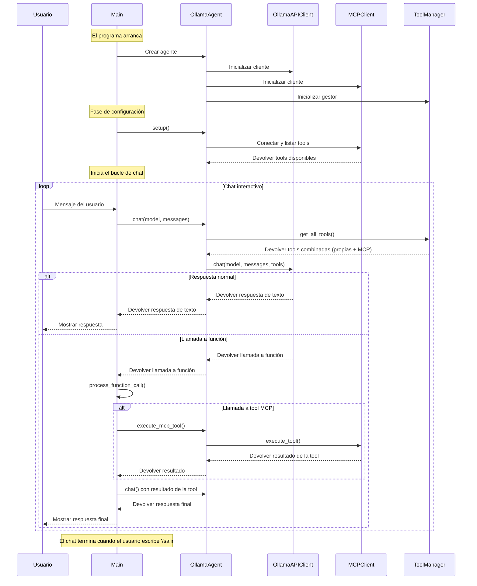

# Flujo del proceso de chat

Este diagrama de secuencia muestra el flujo completo del proceso de chat en la aplicación. A continuación se explica cada fase:

## 1. Inicialización

- El programa arranca creando una instancia de `OllamaAgent`
- El agente inicializa tres componentes principales:
  - `OllamaAPIClient`: para la comunicación con Ollama
  - `MCPClient`: para gestionar las tools MCP
  - `ToolManager`: para administrar todas las tools disponibles

## 2. Fase de configuración

- Se ejecuta el método `setup()` del agente
- Se establece conexión con el servidor MCP
- Se obtiene la lista de tools MCP disponibles

## 3. Bucle de chat interactivo

El bucle principal sigue este flujo:

1. El usuario escribe un mensaje
2. El mensaje se procesa a través del agente
3. El agente:
   - Obtiene todas las tools disponibles
   - Envía el mensaje al modelo de Ollama junto con las tools

## 4. Procesamiento de respuestas

La respuesta puede ser de dos tipos:

### Respuesta normal
- El modelo responde con texto
- La respuesta se muestra directamente al usuario

### Llamada a función
1. El modelo solicita ejecutar una tool
2. Se procesa la llamada:
   - Se identifican los argumentos
   - Se ejecuta la tool (MCP u otra)
   - Se obtiene el resultado
3. El resultado se envía de vuelta al modelo
4. Se obtiene y muestra la respuesta final

## 5. Finalización

- El chat continúa hasta que el usuario escribe `/salir`
- Se cierran las conexiones y el programa termina

## Notas importantes

- El sistema mantiene un historial de mensajes para conservar el contexto de la conversación
- Las tools MCP se prefijan con `mcp_` para identificarlas fácilmente
- Todas las respuestas y errores se registran mediante logging
- El sistema puede manejar múltiples llamadas a función de forma encadenada
